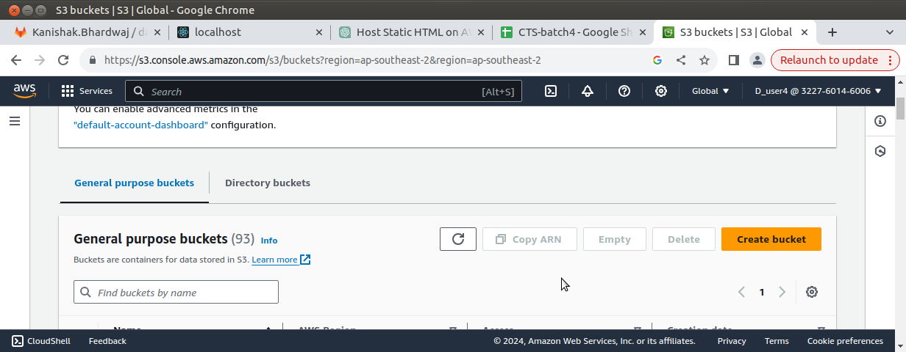

# Static HTML Website Hosting on AWS S3

## Overview

This guide provides step-by-step instructions for hosting a static HTML website on Amazon S3. Amazon S3 is a simple storage service that allows you to store and retrieve any amount of data from anywhere on the web.

## Steps

### 1. Sign in to AWS Console

- Go to the AWS Management Console: [https://aws.amazon.com/](https://aws.amazon.com/).
- Sign in with your AWS account credentials.

### 2. Navigate to S3

- In the AWS Management Console, navigate to the S3 service.

### 3. Create a new S3 bucket

- Click on the "Create bucket" button.
- Choose a globally unique name for your bucket.
- Choose the region where you want your S3 bucket to be located.
- Leave other settings as default or adjust according to your requirements.
- Click "Create bucket."

### 4. Upload your HTML files to the S3 bucket

- Open your newly created S3 bucket.
- Click on the "Upload" button.
- Upload your HTML files and any other static assets (CSS, images, etc.) that your website requires.

### 5. Set permissions for your bucket

- Select the uploaded files and click on the "Actions" button.
- Choose "Make public" to ensure that your files are accessible over the internet.

### 6. Enable static website hosting

- In the S3 bucket properties, go to the "Static website hosting" card.
- Click on the "Edit" button.
- Choose "Use this bucket to host a website."
- Set the "Index document" to your main HTML file (e.g., `index.html`).
- Optionally, set the "Error document" if you have a custom error page.
- Click "Save changes."

### 7. Configure bucket policy

- If your bucket isn't public by default, you might need to configure a bucket policy. Go to the "Permissions" tab and add a bucket policy allowing public access.

### 8. Access your website
- After saving the changes, your S3 bucket will provide an endpoint for your static website. You can find the endpoint URL in the "Static website hosting" card.
- Open the provided endpoint URL in your web browser, and you should see your static HTML website.

